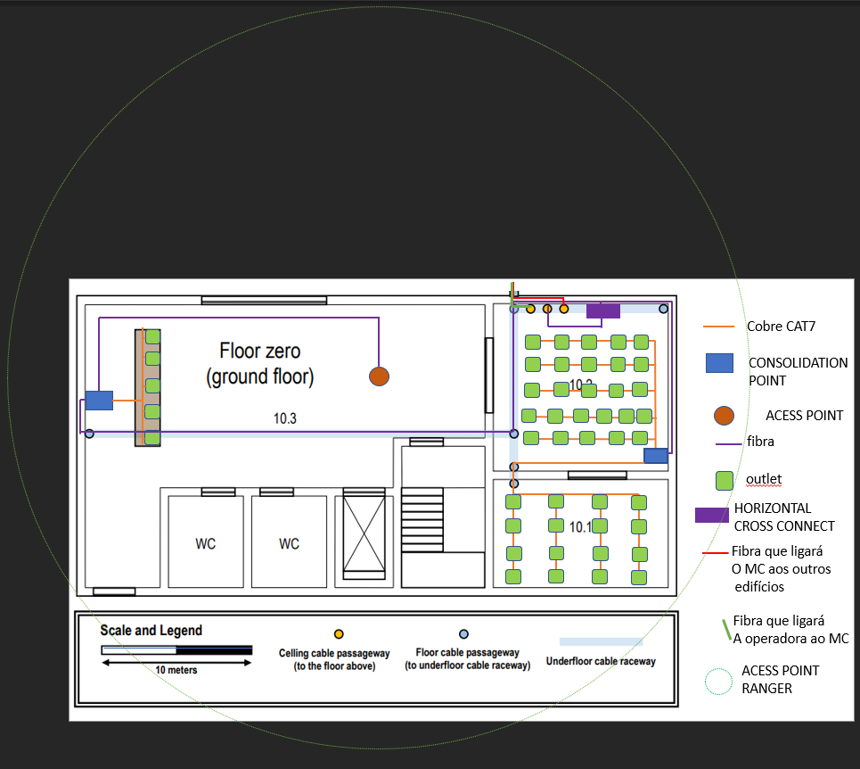
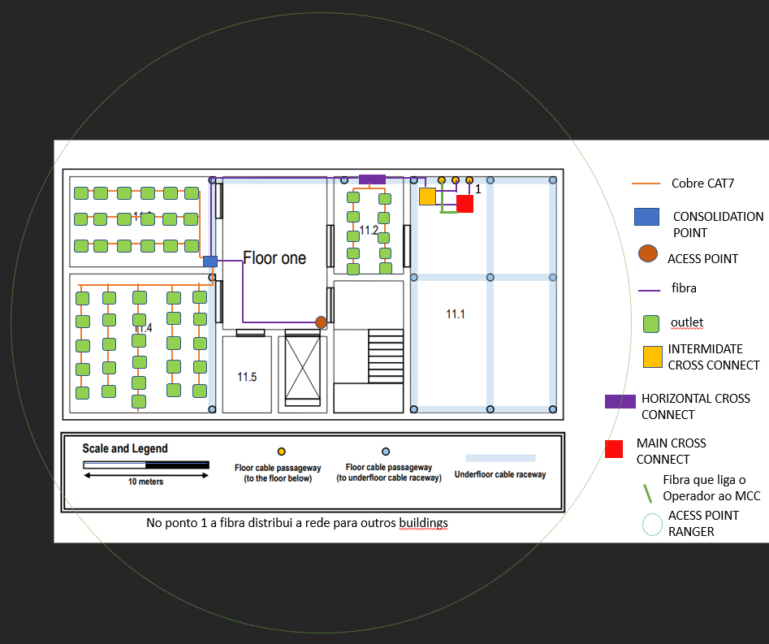

RCOMP 2020-2021 Project - Sprint 1 - Member 1190402 folder
===========================================

## BUILDING 1 ##

### Áreas ###
Conversão usada para as medições seguintes: 10m=3.7cm

### Piso 0 ###

|Sala   |  Área(m^2) | Número de outlets|
|---|---|---|
| 10.1  |11,35*10,81= 79.77 |16|
| 10.2  |11,35*10,81= 122.72 |26|
|10,3|(26,22 * 8,65)+(3,24 * 20,27)+(4,86 * 6,48)=324,03|0
|Entrance Desk|1,62*10,27= 16,65|5 (requisito)|

### Piso 1 ###
Conversão usada para as medições seguintes: 10m=3.7cm

|Sala   |  Área(m^2) | Número de outlets|
|---|---|---|
|11.1| 18,65*11,62=216,73|0
|11.2| 7,57*5,41=40,91	|10
|11.3	|11,62*7,03=81,67	|18
|11.4	|11,62*11,08=128,78	|26
|11.5|5,95*3,78=22,50|0

# Estrutura de Cabeamento

## Piso 0

  

## Piso 1

  

## Verificações

- 2 outlets a cada 10 m²

- Fibra multimodo entre os Switch, IC e HC

- Cabo de Cobre do tipo CAT7 dos Switch para os outlets

- Routers (dos Access Points) a uma distancia de +/- 50 metros de diâmetro, e em caso de overlap, sintonizados em canais diferentes (1,6 e 11)

- Em qualquer ponto de uma sala e possível encontra um outlet num raio de 3 metros

**Tipo de cabos utilizados e os caminhos por eles percorridos**

No interior dos edifícios a utilização de fios de cobre (CAT7) será valorizada e adotada na planificação deste edifício (desde que sejam inferiores a 90 metros).
A ligação entre bastidores (IC,HC,CP,MC) será feita por cabos de fibra, e vão ser usados 2 por ligação para suportar a rede em caso de falha de 1 destes. Os APs vão ser ligados por fios de fibra.

# CABOS #

## Piso 0 ##
Conversão usada para os cálculos seguintes: 10m=6,41cm

-Metros de cabos necessários:

**Cobre:**

Entrance Desk=22,4m

10.1=286,42m

10.2=204,31m

Total:513,12m

**Fibra:**

Total: 284,131 m (considerando que todas as ligações entre bastidores usam 2 cabos de fibra )

## Piso 1 ##
Conversão usada para os cálculos seguintes: 10m=5,88cm
-Metros de cabos necessários:

**Cobre:**

11.1=0m

11.2=50,4m

11.3=149,54m

11.4=312,7m

11.5=0m

Total:507,41m

**Fibra:**

Total: 96,97 m  (considerando que todas as ligações entre bastidores usam 2 cabos de fibra)

## Inventário ##

nr outlets total= 101

Cabos de Cobre: 1020,53 m + (101 * 0,5)= 1020,53 + 50,5= 1071,03 m

Cabos de Fibra: 381,101 + (0,5*nº de ligações entre hc-cp /cp-ap =>5)=383,601 m

**Piso 0**

Total de tomadas:47

CP:2

-um cp um na sala 10.2 com um patch panel cobre de 48 portas (2u) e com a junção do switch cobre (1U) a este e a necessidade de haver 50% de espaço livre teria de ser colocado um CP com capacidade 6U(2*(2u+1u)),

-outro na zona da entrance desk com um patch panel cobre de 24 portas(1U) ao adicionar o switch cobre (1u) um patch panel de fibra de 24 portas (1u) e um switch fibra (1u) e tendo em conta a regra de espaço já mencionada teria de ser colocado um cp com a capacidade 8U (2 *(1u+1u+1u+1u)).

HC: Usado 1 hc na sala 10.2 com um patch panel de fibra de 24 portas (1U) e um switch de fibra (1u) a este e a necessidade de haver 50% de espaço livre teria de ser colocado um HC com capacidade [4U (2*(1u+1u))], mas como o tamanho mínimo é 6U terá de ser de 6U.

AP: 1 AP localizado na zona central em canal 1 de 2,4GHz.

**Piso 1**

Total de tomadas: 54

IC: localizado perto do MC

CP: Usado 1 cp na sala 11.3 com um patch panel de cobre de 48 portas (2u) e com a junção do switch cobre (1U) ,1 patch panel fibra de 24 portas(1u) e 1 switch fibra (1u) a este e a necessidade de haver 50% de espaço livre teria de ser colocado um CP com capacidade 10U(2*(2u+1u+1u+1u))

HC: Usado 1 hc na sala 11.2 com um patch panel cobre de 24 portas (1u) , um switch de cobre (1U),e um patch panel de fibra de (1u) e um switch de fibra(1u) a este e a necessidade de haver 50% de espaço livre teria de ser colocado um HC com capacidade [8U (2*(1u+1u+1u+1u))]

AP: 1 AP localizado na zona central em canal 6 de 2,4GHz.

MC: 1 mc localizado na sala 11.1 do edifício este terá de suportar ligações para todos os 5 edifícios
--
NOTA:

1U PATCH PANEL= 24 PORTAS
1U SWITCH= 48 PORTAS
__

Todos os CPS e HCS têm pelo menos duas entradas para cabos de fibra nos switches.
