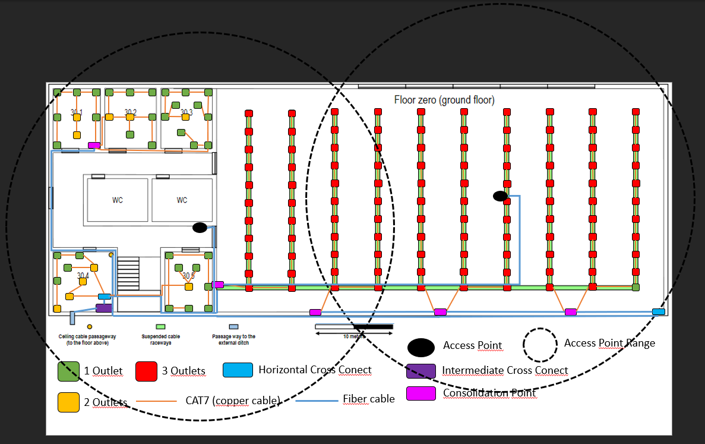
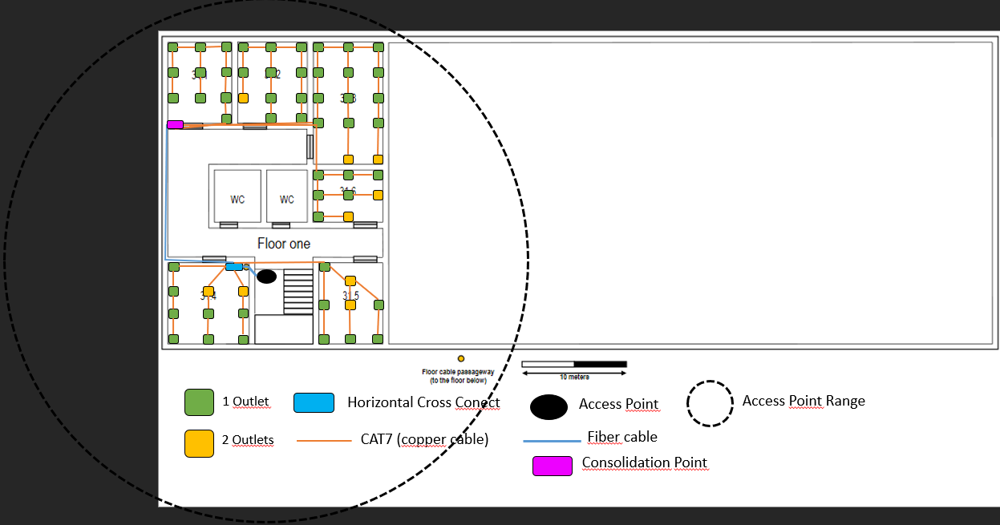

RCOMP 2019-2020 Project - Sprint 1 - Member 1190402 folder
===========================================

## BUILDING 1 ##

####### NOTA: Há cabos nas paredes e CPs nas paredes.

### Escala ###
| Escala       |        |        |
| ------------ | ------ | ------ |
| 1            | cm     | para   |
| 4.761904762  | metros |        |

### Áreas ###

### Piso Zero ###

| Piso Zero                                   |               |  |           |           |            |                  |  |
| ------------------------------------------- | ------------- |  | --------- | --------- | ---------- | ---------------- |  |
| Sala                                        | Comprimento m |  | Largura m | Área m^2  | Nr Outlets | Nº quadrados 3x3 |  |
| 30.1                                        | 7.6190        |  | 6.1905    | 47.1655   | 10         | 5.240615         |  |
| 30.2                                        | 7.6190        |  | 6.4286    | 48.9796   | 10         | 5.442177         |  |
| 30.3                                        | 7.6190        |  | 6.6667    | 50.7937   | 12         | 5.643739         |  |
| 30.4                                        | 7.6190        |  | 7.6190    | 58.0499   | 12         | 6.449987         |  |
| 30.5                                        | 7.6190        |  | 5.9524    | 45.3515   | 10         | 5.039053         |  |
| Espaço aberto                               | 57.1429       |  | 28.5714   | 1632.6531 | 328        | 181.4059         |  |
| Trás da escada                              | 5.7143        |  | 2.8571    | 16.3265   | 0          | 1.814059         |  |
|                                             |               |  |           | Total:    | 382        |                  |  |

| Corredor Lateral entre as salas 30.1 a 30.3 |               |  |           |           |            |                  |  |
| ------------------------------------------- | ------------- |  | --------- | --------- | ---------- | ---------------- |  |
| Comprimento                                 | 20.4762       |  |           | m         |            |                  |  |
| Largura                                     | 2.8571        |  |           | m         |            |                  |  |
| Área                                        | 58.5034       |  |           | m^2       |            |                  |  |
| Nr Outlets                                  | 0             |  |           |           |            |                  |  |

| Corredor Lateral entre as salas 30.4 a 30.5                 |  |         |  |     |
| ----------------------------------------------------------- |  | ------- |  | --- |
| Comprimento                                                 |  | 7.6190  |  | m   |
| Largura                                                     |  | 7.6190  |  | m   |
| Área                                                        |  | 58.0499 |  | m^2 |
| Nr Outlets                                                  |  | 0       |  |     |

| Corredor Vertical entre as salas 30.1 e 30.4                |  |         |  |     |
| ----------------------------------------------------------- |  | ------- |  | --- |
| Comprimento                                                 |  | 5.7143  |  | m   |
| Largura                                                     |  | 3.8095  |  | m   |
| Área                                                        |  | 21.7687 |  | m^2 |
| Nr Outlets                                                  |  | 0       |  |     |

| Retirou-se partes do corredor lateral das salas 30.1 a 30.3 |
| ----------------------------------------------------------- |

| Retirou-se partes do corredor lateral das salas 30.4 a 30.5 |  
| ----------------------------------------------------------- |  

### Piso Um ###

| Piso Um                                            |               |  |           |           |            |                  |  |
| --------------------                               | ------------- |  | --------- | --------- | ---------- | ---------------- |  |
| Sala                                               | Comprimento m |  | Largura m | Área m^2  | Nr Outlets | Nº quadrados 3x3 |  |
| 31.1                                               | 7.6190        |  | 5.9524    | 45.3515   | 10         | 5.039053         |  |
| 31.2                                               | 7.6190        |  | 6.6667    | 50.7937   | 12         | 5.643739         |  |
| 31.3                                               | 11.4286       |  | 6.6667    | 76.1905   | 16         | 8.465608         |  |
| 31.4                                               | 7.6190        |  | 7.6190    | 58.0499   | 12         | 6.449987         |  |
| 31.5                                               | 5.7143        |  | 7.6190    | 43.5374   | 10         | 4.837491         |  |
| 31.6                                               | 6.6667        |  | 6.6667    | 44.4444   | 10         | 4.938272         |  |
| Espaço aberto                                      | 57.1429       |  | 28.5714   | 1632.6531 | 0          | 181.4059         |  |
| Espaço entre 31.4 e 31.5 atrás	das escadas        | 5.7143        |  | 2.3810    | 13.6054   | 0          |                  |  |
|                                                    |               |  |           | Total:    | 70         |                  |  |

| Corredor Lateral entre as salas 31.1 a 31.3                 |         |         |  |     |
| ----------------------------------------------------------- | ------- | ------- |  | --- |
| Comprimento                                                 | 13.3333 |         |  | m   |
| Largura                                                     | 3.3333  |         |  | m   |
| Área                                                        | 44.4444 |         |  | m^2 |
| Nr Outlets                                                  | 0       |         |  |     |

| Corredor Vertical entre as salas 31.1 e 31.4                |         |         |  |     |
| ----------------------------------------------------------- | ------- | ------- |  | --- |
| Comprimento                                                 |         | 5.7143  |  | m   |
| Largura                                                     |         | 3.8095  |  | m   |
| Área                                                        |         | 21.7687 |  | m^2 |
| Nr Outlets                                                  |         | 0       |  |     |
| Retirou-se partes do corredor lateral das salas 31.1 a 31.3 |         |         |  |     |
| Retirou-se partes do corredor lateral das salas 31.4 a 31.5 |         |         |  |     |

# Estrutura de Cabeamento

## Tipo de cabos utilizados e os caminhos por eles percorridos

No interior dos edifícios a utilização de fios de cobre (CAT7) será valorizada e adotada na planificação deste edifício (desde que sejam inferiores a 90 metros). A conexão entre ligações entre bastidores (IC,HC,CP) vai ser valorizado a ligação por cabos de fibra, e vão ser usados 2 por ligação para evitar possíveis falhas na rede. Os APs vão ser ligados por fibra multimodo.

## Piso 0

  

## Piso 1

  

# Inventário do material utilizado #

## Piso 0

### 30.1)
*         Cobre CAT7      : 36,25 metros
*         Fibra multimodo : 0 metros

### 30.2)
*         Cobre CAT7      : 28,61 metros
*         Fibra multimodo : 0 metros

### Ligação entre as salas 30.1) e 30.2)
*         Cobre CAT7      : 43,1 Metros
*         Fibra multimodo : 0 metros

### 30.3)
*         Cobre CAT7      : 68,04 metros
*         Fibra multimodo : 0 metros

### 30.4)
*         Cobre CAT7      : 58,94 metros
*         Fibra multimodo : 10,38 metros

### Ligação entre as salas 30.1) e 30.3)
*         Cobre CAT7      : 178,44 metros
*         Fibra multimodo : 0 metros

### Ligação entre as salas 30.4) e 30.1)
*         Cobre CAT7      : 0 metros
*         Fibra multimodo : 33,98 metros

### 30.5)
*        Cobre CAT7      : 43,81 metros
*        Fibra multimodo :  0 metros

### Ligação entre as salas 30.4) e 30.5)
*        Cobre CAT7      : 63,53 metros
*        Fibra multimodo : 0 metros

### Fiação para o Acess Point ao lado da sala 30.5)
*        Cobre CAT7      : 0 metros
*        Fibra multimodo : 26,66 metros

### Fibra entre o HCC e os CPs do Espaço Aberto e entre o ICC e o HCC do Espaço Aberto)
*        Cobre CAT7      : 0 metros
*        Fibra multimodo : 92,68 metros

### Espaço_Aberto)
*        Cobre CAT7      : 1704,64 metros
*        Fibra multimodo : 50,71 metros

## Total de cobre CAT7 do piso 0: 3548,55 metros
## Total de fibra multimodo do piso 0 : 214,41 metros

## Nº Outlets -> 382
## Nº ICCs   
## Nº HCs     -> 2 (+ de 1000 metros quadrados de área) (1 de 8Us (2x(1U patch panel cobre + 1U switch de cobre +1U patch panel de fibra + 1U switch de fibra)) e 1 de 6Us (2x(1U patch panel de fibra + 1U switch de fibra)) (era 4U mas no mínimo 6U)
## Nº CPs     -> 5 ( 1 de 6Us (2x(2Us de patch panel + 1U switch de cobre)), 2 de 10Us (2x(3 Patch panels de cobre + 2 Switches de cobre)) e 2 de 16Us (2x(5 Patch panels de cobre + 3 Switches de cobre))
## Nº APs     -> 2 (canais 1 e 6) de 2.4 GHz

## Piso 1

### 31.1)
*        Cobre CAT7      : 103,93 metros
*       Fibra multimodo : 0 metros

### 31.2)
*        Cobre CAT7      : 173,46 metros
*        Fibra multimodo : 0 metros

### Ligação entre as salas 31.1), 31.3) e 31.6)
*        Cobre CAT7      : 400,47 metros    
*        Fibra multimodo : 0 metros

### 31.3)
*       Cobre CAT7      : 153,41 metros
*       Fibra multimodo : 0 metros

### Ligação entre as salas 31.4) e 31.1)
*       Cobre CAT7      : 0 metros
*       Fibra multimodo : 19,29 metros

### 31.4)
*      Cobre CAT7      : 51,04 metros
*      Fibra multimodo : 0 metros

### Ligação entre as salas 31.4) e 31.5)
*      Cobre CAT7      : 8,54 metros
*      Fibra multimodo : 0 metros

### 31.5)
*      Cobre CAT7      : 33,55 metros
*      Fibra multimodo : 0 metros

### 31.6)
*     Cobre CAT7      : 29,29 metros
*     Fibra multimodo : 0 metros

## Total de cobre CAT7 do piso 1: 1030,55 metros
## Total de fibra multimodo do piso 1 : 19,29 metros

## Nº Outlets -> 70
## Nº ICCs    -> 0
## Nº HCs     -> 1 de  8Us (2x(1 Patch panel + 1 Switch de Cobre + 1 Switch de fibra + 1 Patch panel de fibra))
## Nº CPs     -> 1 de 10 Us (2x(3 Patch panel de cobre + 2 Switch de cobre))
## Nº APs     -> 1 (canal 11) 2.4 GHz

# Total de outlets : 452
# Total de ICs: 1
# Total de HCs: 3
# Total de CPs: 6
# Total de APs: 3 (canais 1,6 e 11)

# Total de cobre CAT7 do Edifício 3 : 4579,1 + 328 * 0,5 (patch cords de 0,5 metros por cada outlet) = 4743,1 metros
# Total de fibra multimodo do Edifício 3 : (237,7 + 3 (patch cords)) * 2 (cable redundancy, cada cabo terá outro suplente por segurança da rede) = 480,6 metros

###### NOTA: Todos os CPs e todos os HCs têm pelo menos duas entradas para cabos de fibra nos switchs.
###### NOTA: 1U Switch de cobre -> 48 portas, Switch de fibra -> 48 portas, Patch panel fibra -> 24 portas, Patch panel cobre -> 24 portas
