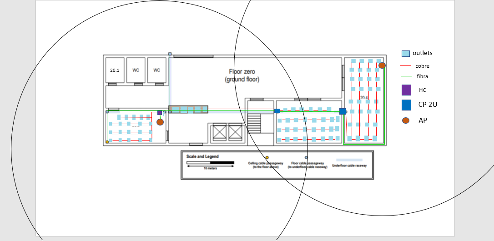
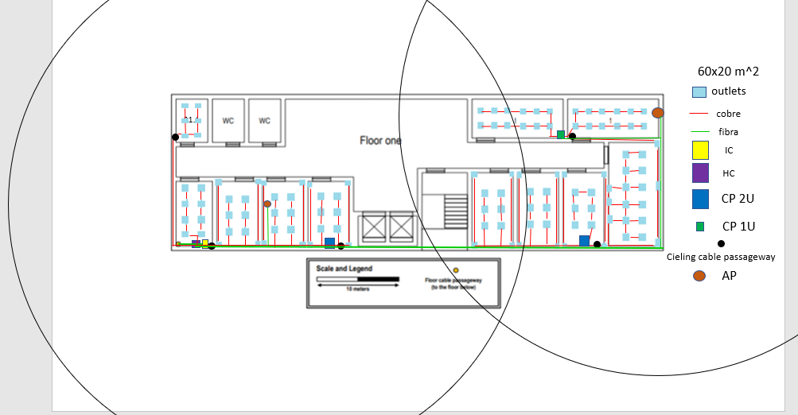

RCOMP 2020-2021 Project - Sprint 1 - Member 1191072 folder
===========================================

## BUILDING 2 ##

### Áreas ###

### Piso 0 ###

|Conversão|   |
|-----|-------|
|10 m |	2,4 cm|
|x m	|y cm	  |

|Sala |  Área(m^2)  |Número de outlets|
|-----|-------------|-----------------|
|20.1	|4,1*5,8=23,8 |0                |
|20.2	|12,9*7,5=96,8|19,4~20          |
|20.3	|14,2*10=142  |28,4~29--30      |
|20.4	|8,3*18,8=156 |31,2~32          |
|mesa |8,3*1,7=14,1 |5                |

### Piso 1 ###

|Sala|  Área(m^2)  |Número de outlets|
|----|-------------|-----------------|
21.1 |4,1*5,8=23,8 |6                |
21.2 |4,6*8,3=38,2 |7,64~8           |
21.3 |5*8,3=41,5   |8,3~9--10        |
21.4 |5*8,3=41,5   |8,3~9--10        |
21.5 |5*8,3=41,5   |8,3~9--10        |
21.6 |5*9,6=48     |9,6~10           |
21.7 |5*9,6=48     |9,6~10           |
21.8 |5*9,6=48	   |9,6~10           |
21.9 |6,3*13,3=83,8|16,76~17--18     |
21.10|11,3*5=56,5	 |11,3~12          |
21.11|11,3*5=56,5  |11,3~12          |

# Estrutura de Cabeamento

## Piso 0

## Piso 1

## Verificações

- 2 outlets a cada 10 m²;

- Fibra multimodo entre os Switch e HC e entre IC e HC no piso um;

- Cabo de Cobre do tipo CAT7 dos Switch para os outlets;

- 2 Routers para cobertura máxima de toda a área de cada piso do builing 2;

- Em qualquer ponto dentro duma sala é possível encontrar um outlet num raio de 3 metros.

**Tipo de cabos usados e os caminhos percorridos**

No interior dos edifícios são utilizados fios de cobre (CAT7) para a planificação deste edifício (desde que sejam inferiores a 90 metros).
A ligação entre bastidores (IC,HC,CP,MC) será feita por cabos de fibra, os AP também são ligados por fios de fibra.

# Metros de Cabos Necessários#

### Conversão ###

3,9 cm -> 10 m

## Piso 0 ##

|Sala     |Cabos de cobre(cm)|Cabos de cobre(m)|
|---------|------------------|-----------------|
|20.1	    |0                 |0                |
|20.2	    |69,5              |178,205          |
|20.3	    |98,7              |253,077          |
|20.4	    |171,6             |440              |
|Entrance |33,25             |85,3             |

Total: 956,54 m

### Fibra ###

Total: 46,7 cm -> 119,744 m ---- 119,744*2 = 239,49 m (sendo que todas as ligações entre bastidores usam 2 cabos de fibra)

## Piso 1 ##

|Sala     |Cabos de cobre(cm)|Cabos de cobre(m)|
|---------|------------------|-----------------|
21.1      | 58,2             | 149.231         |
21.2      | 11,6             | 29,7            |
21.3      | 47,4             | 121,54          |
21.4      | 47,4             | 121,54          |
21.5      | 31,65            | 81,15           |
21.6      | 42,8             | 109,74          |
21.7      | 42,8             | 109,74          |
21.8      |	25,35            | 65              |
21.9      | 55,1             | 141,28          |
21.10     |	27,6             | 70,77           |
21.11     | 30               | 76,92           |

Total: 1131,92 m

### Fibra ###

Total: 40,8 cm -> 104,615 m ---- 104,615*2 = 209,23 m (sendo que todas as ligações entre bastidores usam 2 cabos de fibra)

# Inventário #

## Piso 0 ##

| Material   |  Quantidade|
|---|---|
| Horizontal cross-connect| 1 ->fará 20 ligações a outlets|
| Copper Patch panel 48 port (CP)|2 ->fará 32 e 35 ligações a outlets|

Total de tomadas: 87.

Para o HC: Patch panel do tipo CAT7 com 48 portas (2U) e outro de fibra com 24 portas (1U), assim adicionamos dois switch (2U),um cobre outro fibra, ficando com 5U total. Como temos de ter 50% de espaço livre, é colocado um HC com capacidade para 10U.

Para o CP: 2 CPs. Um tem patch panel do tipo CAT7 com 48 portas (2U), assim adicionamos switch (1U), para ter 50% de espaço livre é então colocado um CP com capacidade 6U.
O outro tem patch panel do tipo CAT7 com 48 portas (2U), assim adicionamos switch (1U) e um patch panel de fibra de 24 portas (1U) e um switch de fibra (1U), para ter 50% de espaço livre é então colocados CP com capacidade 10U.

Para o AP: 2 APs, com os canais 1 (localizado mais há esquerda) e 6 (localizado mais há direita) de 2,4GHz.

## Piso 1 ##

| Material   |  Quantidade |
| ---|---|
| Intermediate cross-connect|1 |
| Horizontal cross-connect|1 ->fará 8 ligações a outlets
| Copper Patch panel 24 port (CP) |1   ->fará 24 ligações a outlets
| Copper Patch panel 48 port (CP)|2    ->fará 48 e 36 ligações a outlets

Total de tomadas: 116.

Para o HC: Patch panel do tipo CAT7 com 24 portas (1U) e outro de fibra tambem com 24 portas (1U), assim adicionamos um switch de cobre (1U) e outro de fibra (1U), ficando com 4U total. Como temos de ter 50% de espaço livre, é colocado um HC com capacidade para 8U.

Para o IC: IC localizado junto ao HC.

Para o CP: 3 CPs, dois com Patch panel do tipo CAT7 com 48 portas (2U) e outro de fibra de 24 portas (1U), assim adicionamos um switch de cobre (1U) e outro de fibra (1U), ficando com 5U total. Como temos de ter 50% de espaço livre, teria de ser colocado para cada CP a capacidade de 10U.
Um com Patch panel do tipo CAT7 com 24 portas (1U), assim adicionamos um switch (1U), ficando com 2U total. Como temos de ter 50% de espaço livre, teria de ser colocado um CP com capacidade para 4U, mas sendo o mínimo 6U, então é esse que colocamos.

Para o AP: 2 APs, com os canal 11(localizado mais há esquerda) e 1 (localizado mais há direita) de 2,4GHz.

## Total do Building##
Nr Outlets: 203
Cobre: 1131,92+956,54+ (0,5*203)=2088,46+101,5=2189,96 m
Nr ligaçoes aos HC:6
(0,5*6)=3 m
Fibra:239,49+209,23+3=451,72 m
