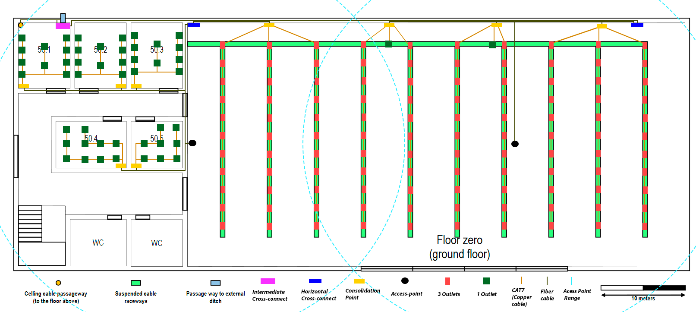

RCOMP 2020-2021 Project - Sprint 1 - Member 1200587 folder

===========================================

## BUILDING 5 ##

## Verificações iniciais ##

    Um HC deve cobrir uma área inferior a 1000m^2. 

    2 outlets a cada 10 m²

    Fibra multimodo entre os Switch, IC , HC e cp.

    Cabo de Cobre do o CAtipo7 dos Switch para os outlets

    Access-points foi considerado um raio de ação de 25m.

    Em qualquer ponto de uma sala e possível encontra um outlet num raio de 3 metros

    1 Patch panel de cobre - 24 portas
    1 Switch de cobre - 48 portas
    1 Patch panel de fibra - 24 portas
    1 Switch de fibra - 48 portas

## Áreas ##

Escala utilizada foi de 5cm = 10m.

## Piso 0 ##

|Sala          | Área(m^2)  |Número de outlets|
|--------------|------------|-----------------|
|50.1          |   45,6     |       10        |
|50.2          |   45,6     |       10        |
|50.3          |   45,6     |       10        |
|50.4          |   44,82    |       10        |
|50.5          |   36       |       8         |
|Espaço aberto |   1647,2   |       332       |

## Piso 1 ##

|Sala          | Área(m^2)  |Número de outlets|
|--------------|------------|-----------------|
|51.1          |   42       |       10        |
|51.2          |   42       |       10        |
|51.3          |   66       |       14        |
|51.4          |   80,46    |       18        |
|51.5          |   72,6     |       16        |

## Inventário ##

### Cabo CAT7 ###

Nota: Todos os calculos estão armazenados na pasta imagens_aux.

### Piso 0 ###

|Sala          | Quantidade de cabo(m)  |
|--------------|------------------------|
|50.1          |         48,2           |
|50.2          |         48,2           |
|50.3          |         48,2           |
|50.4          |         55,8           |
|50.5          |         37,1           |
|Espaço aberto |         4989,16        |
|Total         |         5226,66        |

### Piso 1 ###

|Sala          | Quantidade de cabo(m)  |
|--------------|------------------------|
|51.1          |         45,2           |
|51.2          |         45,2           |
|51.3          |         96,7           |
|51.4          |         190            |
|51.5          |         128            |
|Total         |         506            |

    Total de cabo CAT7 = 5958,66 m.
    Nota: Este total conta com os 0.5m utilizados para cada ligacação dos patch panels e switches.

## Fibra ##

    Nota: Todos os calculos estão armazenados na pasta imagens_aux.

### Piso 0 ###

    Fibra utilizada para a ligação em IC's, HC's, CP's e AP's = 289,8 m.
    Com a redundância de cabos passa a 579,6 m.

### Piso 1 ###

    Fibra utilizada para a ligação em IC's, HC's, CP's e AP's = 161,7 m.
    Com a redundância de cabos passa a 323,4 m.

    Total de fibra = 911,5 m.
    Nota: Este total conta com os 0.5m utilizados para cada ligacação dos patch panels e switches.

## Intermediate cross-connect ##

    Foi utilizado 1 IC constituido para ligar a todos os HC's.

## Horizontal cross-connect ##

#### Piso 0 ####

     2 HC's (+ de 1000m^2) os dois com 6u's para fazer a ligação aos Consolidation Points cada um composto por um patch panel de fibra e um switch de fibra.

#### Piso 1 ####

    1 HC's um com 6u's para fazer a ligação aos Consolidation Points cada um composto por um patch panel de fibra e um switch de fibra.

## Consolidation Points ##

### Piso 0 ###

|Sala          | Quantidade patch panels fibra  | Switches fibra |
|--------------|--------------------------------|----------------|
|50.1          |             1                  |     1          |
|50.2          |             1                  |     1          |
|50.3          |             1                  |     1          |
|50.4          |             1                  |     1          |
|50.5          |             1                  |     1          |
|Espaço aberto |--------------------------------|----------------|
|3 filas esq.  |             5                  |     3          |
|2 filas esq.  |             3                  |     2          |
|2 filas dir.  |             3                  |     2          |
|3 filas dir.  |             5                  |     3          |
|Total         |             21                 |     15         |

    21 CP's - 5 de 6u's, 2 de 16u's e 2 de 10u's.

#### Piso 1 ####

|Sala          | Quantidade patch panels  | Switches |
|--------------|--------------------------|----------|
|51.1          |             1            |     1    |
|51.2          |             1            |     1    |
|51.3          |             1            |     1    |
|51.4          |             1            |     1    |
|51.5          |             1            |     1    |
|Total         |             5            |     5    |

    5 CP's - 5 de 6u's.

## Access-point ##

### Piso 0 ###

    2 access-points de 2,4Ghz um utilizando o canal 1 e o outro o canal 6.

### Piso 1 ###

    1 access-points de 2,4Ghz um utilizando o canal 11.
